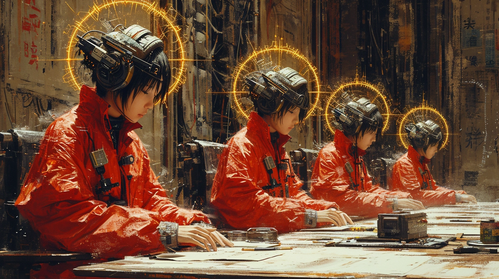
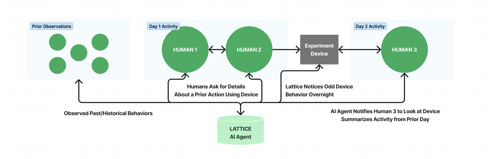

# LATTICE: Collective Observation + Action Platform

---

### WHAT WE ARE BUILDING

This central goal of this project is to create multiple devices for video, audio, and sensory streaming, enabling an AI system to help coordinate an individual or collective towards a goal in realtime.

This system began development within our community of [self-taught synthetic biologists](https://undergroundgarden.club) engineering plants to secrete insulin and exploring climate biotech. By streaming thoughts, observations, and hardware sensors, we are seeding an AI system that can train new members and coordinate existing members rotating **through** wet lab work in between day/night jobs. AI is our bridge. Bi-directional conversation is the medium.

### EXPLORATORY DEVELOPMENT

| ⬛️ | STAGE | DESCRIPTION |
| --- | --- | --- |
| 🟦 | ALPHA 1 | Wearable sensory ingestion (i.e., Halo) and passive multi-modal knowledge distillation systems |
| ⬜️ | ALPHA 2 | Passive and active A.I. guidance systems |
| ⬜️ | ALPHA 3 | Static equipment sensory ingestion and control (i.e., lab equipment) |

### HARDWARE / WEARABLES TEMPLATES

- [**HALO**](/device/halo): Headgear for video/audio/??? observation streaming and bi-directional AI interactions
- ORB: [TODO] Static device for video/audio/??? input of a broad area and/or group

---

### GETTING STARTED

##### SYSTEM DESIGN

ATM, everything is setup to run locally. There are two primary pieces:

> **Hardware**: Build/setup instructions are in the `/devices` directory. We're using a Raspberry Pis for good video/audio processing. Once interaction patterns are sturdy, we'll create our regalpunk aesthetic head piece and custom hardware.

> **AI Agents**: Accepts mp4 queries from devices, parses them for an action to take, and passes it to a respective tool/process. Queries a human can make are in `actor_tools.py`. Passive AI agent activity will be worked on next.

All interactivty with AI agents happens through devices. Viewing the data directly and/or in a web UI is an anti-pattern and a sign that our edge hardware design patterns are failing.

##### RUNNING LOCALLY

- Create your `.env` file, which requires a few services which you will see env vars for in the backend's `env.py`
- Build your [HALO](/device/halo/) hardware device (instructions in [sub-directory](/device/halo/))
- Start a `ngrok` tunnel pointing at the local API
- Ensure your hardware device's API url env param is pointing at that ngrok tunnel endpoint (may require forcing to `http` at the moment)
- Triple click to begin your omnipresecent observer!
- Build collective knowledge, informing future actions you and your friends will take

---

### CONTRIBUTING

If you want to explore and contribute, open up some discssions, issues, and PRs about your wild ideas. Given this is a hardware+software pursuit, we will spend a lot of time in the Github discussions to help folks get started and explore (at least until there is a hosted version of LATTICE that is coordinating improvements through our shared experiences)

