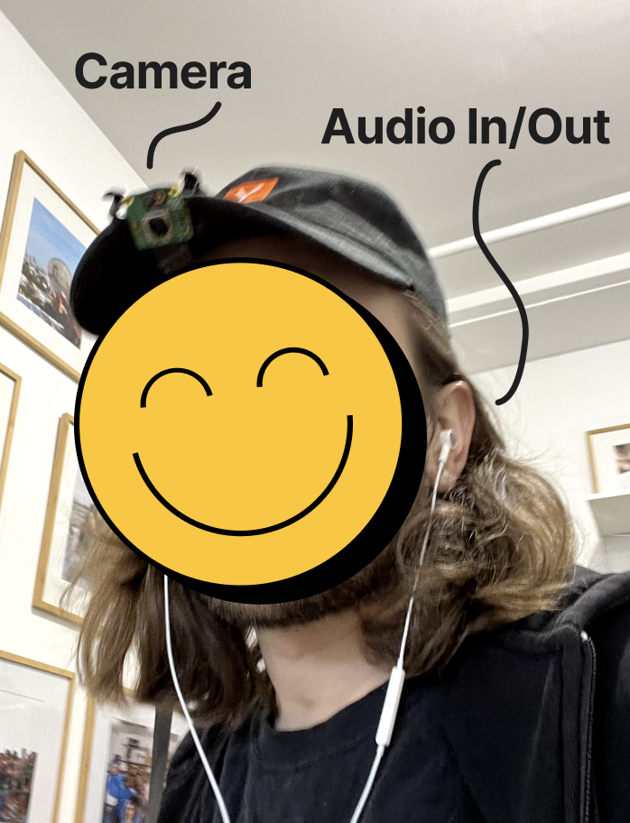
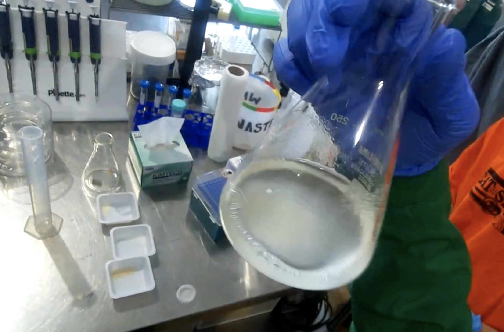
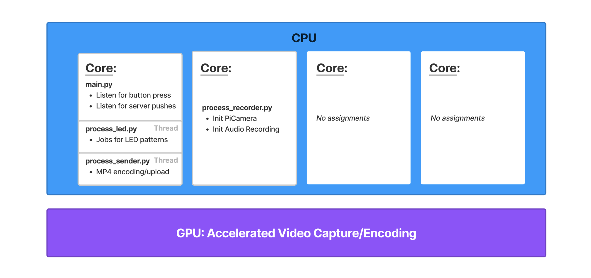
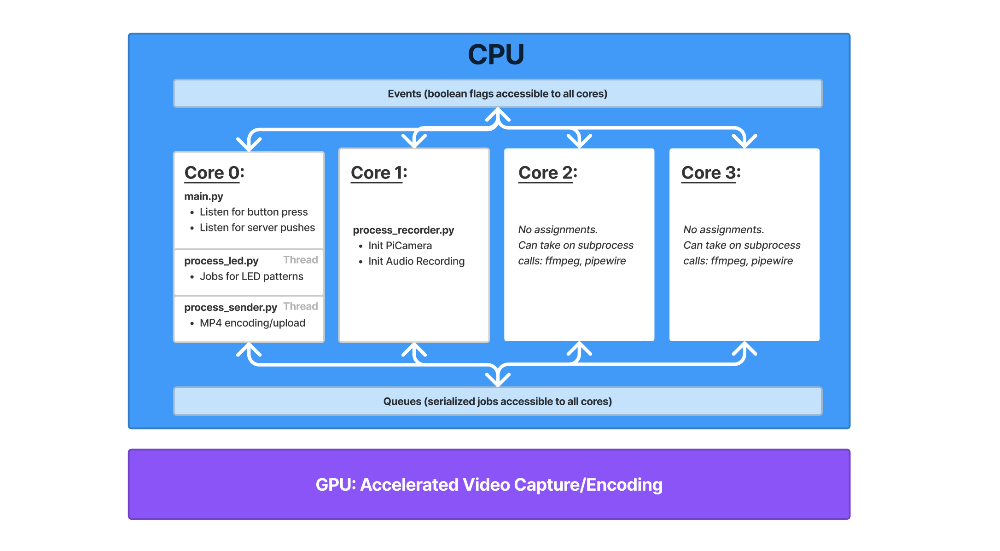
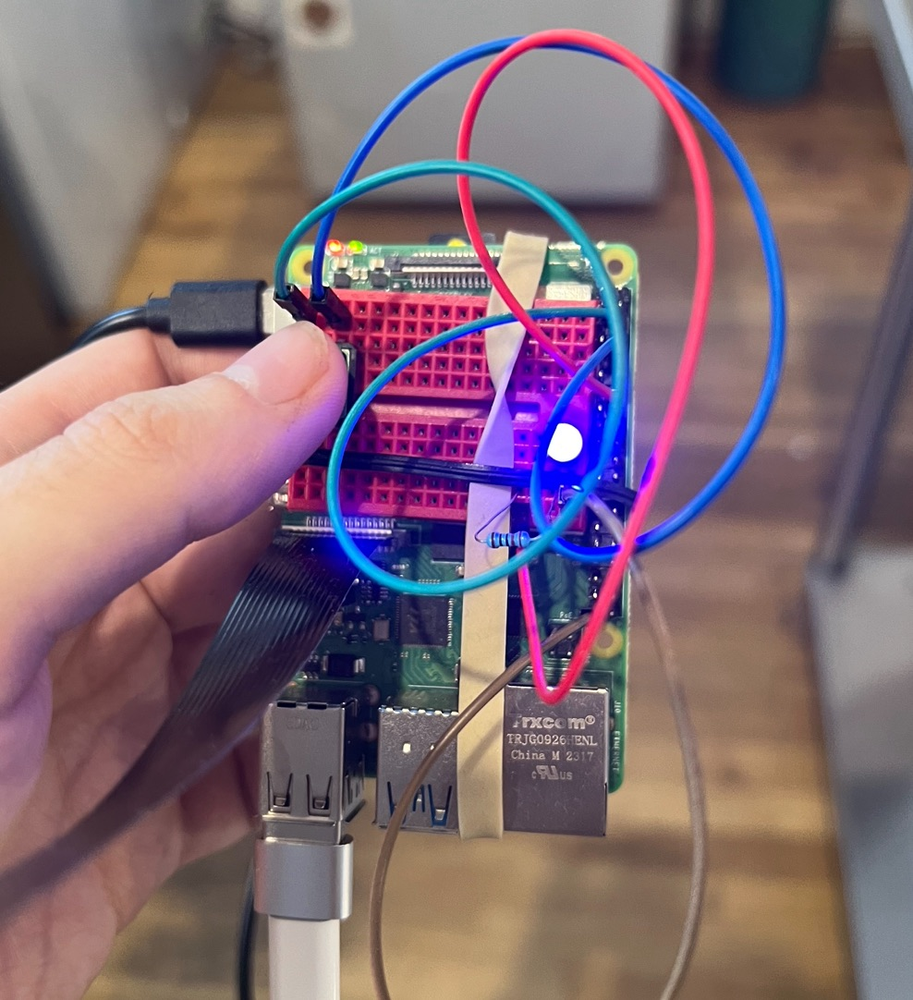
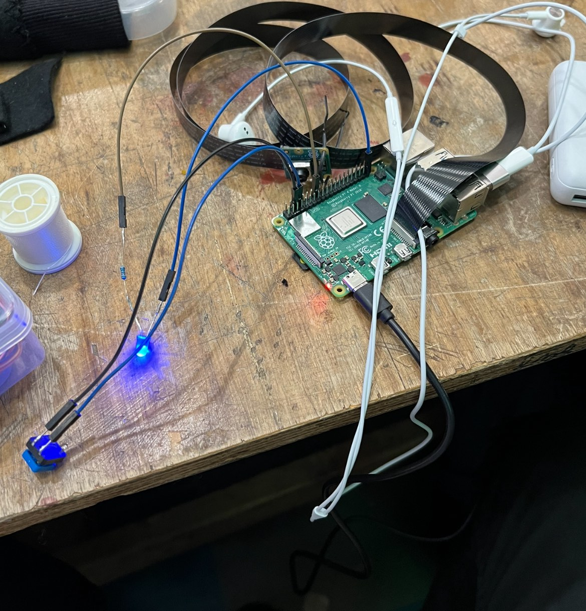
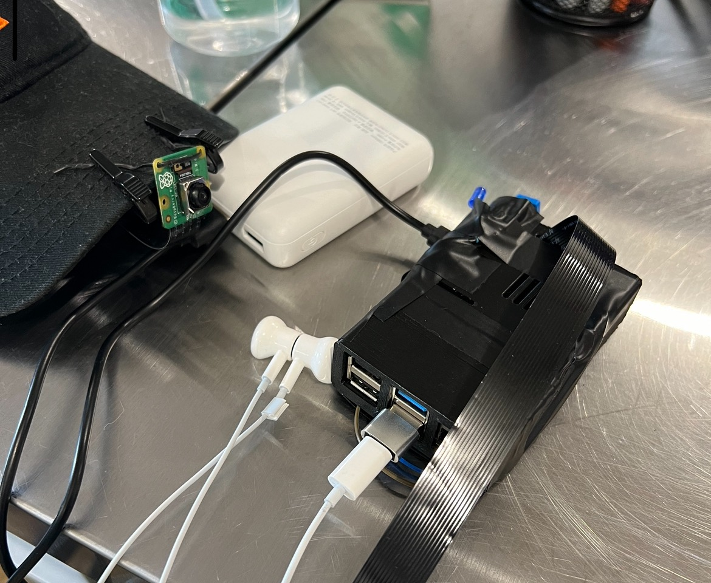
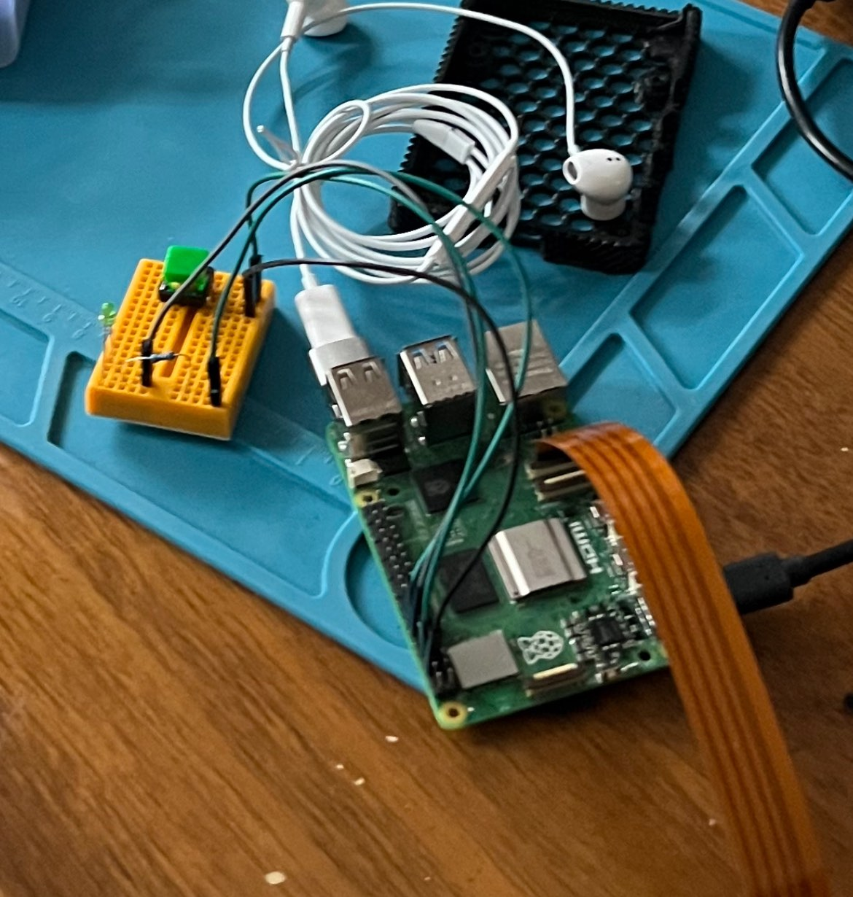

##### LATTICE <!-- omit in toc -->
# ((( HALO ))) <!-- omit in toc -->


---

- [WHAT IS THE (((HALO)))](#what-is-the-halo)
- [BUILDING YOUR (((HALO)))](#building-your-halo)
  - [CONCEPT REQUIREMENTS](#concept-requirements)
  - [DEVICE CONTROL FLOWS](#device-control-flows)
    - [PROCESSORS/THREADS](#processorsthreads)
    - [EVENTS/QUEUES](#eventsqueues)
- [SETUP](#setup)
  - [PARTS LIST](#parts-list)
  - [BUILD](#build)
- [BOOT UP](#boot-up)
  - [LOAD/FLASH RASPBERRY PI OS](#loadflash-raspberry-pi-os)
  - [SSH INTO RPI VIA VSCODE](#ssh-into-rpi-via-vscode)
  - [APT UPDATE/UPGRADE](#apt-updateupgrade)
  - [GIT INSTALL](#git-install)
  - [LINUX DEPS](#linux-deps)
  - [START UP ON POWER UP, SYSTEMCTL](#start-up-on-power-up-systemctl)
  - [WIFI SETUP, NMCLI](#wifi-setup-nmcli)
  - [RELOADING WHEN DOING CHANGES](#reloading-when-doing-changes)
  - [DEBUGGING](#debugging)
- [RASPBERRY PI -VS- ESP32 FOR MVP](#raspberry-pi--vs--esp32-for-mvp)
- [CONTRIBUTING](#contributing)

---

##### WHAT IS LATTICE

The central goal of this project is to create multiple devices for video, audio, and sensory streaming, enabling an AI system to help coordinate an individual or collective towards a goal in realtime. The guide below will focus on the (((HALO))) headpiece. Check out the root [README](../..) for platform setup.


---

## WHAT IS THE (((HALO)))
> Reminder: This is a work in progress and just the beginning of what we want to build.

The HALO is our pursuit for making regalpunk wearable worn on the head, for capturing multiple streams of information starting simply with video/audio and also playing back audio to the wearer from the AI coordinating LATTICE system. The HALO, and this system, is placing its focus on those who have long duration tasks that involve movement and the use of both hands. **We are excited to push the ideas of realtime collective experiences**.

---

## BUILDING YOUR (((HALO)))


### CONCEPT REQUIREMENTS

For this scenario to work, we are simultaneously recording video/audio for record (no dropped frames, high quality). We are also on device querying specific questions and annotating bits of information. In this first version, we do not *need* streaming. Let me paint a scenario:

> You're in a laboratory, mixing reagents to create a structure that can gel together. You walk away from work bench to the pressure cooker to sterilize the materials. 
> 
> You forget how long too pressure cook it for, you ask "How long did I autoclave the MS+Agar media for last time?" Your assistant responds "30 minutes". You remember you had contamination, so you say back, "In this next step, I'm going to autoclate the media for 45 minutes".
> 
> When it's done, your AI assistant pings your ear piece saying it's complete. Afterwards you bring the miexture to a sterlized work space, where you start to pour it into plates.

| MVP Wearable | (((HALO))) Video/Audio Observations |  v1 AI Agent Reactions |
| --- | --- | --- |
|  |  |  |


Here is what's happening on the device in terms of CPU/GPU activity:

  - Video Capture (GPU, capture not-blocking)
  - Audio Capture (CPU, capture blocking)
  - Audio Playing (CPU)
  - Merging Video/Audio into MP4 encoding (CPU, blocking, possibly offload to backend)
  - Media storage (ex: S3/Media Server), Data/Message Fetching (CPU, cadence of blocking)
  - Peripherals (ex: LEDs, Buttons) listening and interactions (CPU)

---

### DEVICE CONTROL FLOWS

Now that you see the simultaneous activity on the device, here's how it's being coordinated via CPU/GPU with the `multiprocessing` module.

#### PROCESSORS/THREADS



Since our Raspberry Pi has 4 cores, we're going to use the `multiprocessing` lib best we can. When our program runs `main.py` we're on core 0, that is where our loop listens for button presses and polls for updates.

Because video/audio recording is high value and cannot be competed for by a core, I specify a separate `process` for that code. We don't want anything else to get in the way of that sequential processing flow.

However, LED patterns can be blocking because I like to do multiple blinks when errors occur for example. This is where `threads` come into play. Rather than dedicate an entire processor to a low-value task like LED blinking, we'll break it out into a thread. This means that core 0, while continuing its serial processing, can alternate between the main interaction listening and threaded LED code.

Additionally, you'l notice that the function responsible for executing MP4 encoding (video and audio captured separately and we join on device). That is hefty because it requires `ffmpeg`, so why not also give that a separate process? That is because in that loop, we are calling a `subprocess` for ffmpeg, not running it in python. This is where unassigned cores 2 and 3 can pick up that subprocess for execution. That is why I purposefully have many threaded actions on core 0, to ensure the system can utilize core 2/3 as it needs.

> Note: I am new to hardware, if my descriptions above have inaccuracies, let me know! Leave an issue!


#### EVENTS/QUEUES



With responsibilities split between cores, how do we message pass between them to control the system? That is where `events` & `queues` come into play. I think of `events` as our boolean flags, that tell us if there is a state of behavior active, such as "is recording". `Queues` are ways of requesting some action, that needs data associated with it, such as an ID that we're tagging all recordings in a series with. All of our event and queue references are passed into each process/thread instantiation, becoming access to all our multiprocessing core code. Here are quick examples of each:

**Event**

```python
# main.py (core 0)
process_events = {
  "event_is_recording_series": multiprocessing.Event()
}
multiprocessing.Process(args=(process_events))

# processor_recorder.py (core 1)
if pe["event_is_recording_series"].is_set() == True:
  # ... some behavior 
```

**Queue**

```python
# main.py (core 0)
process_queues = {
  "queue_recorder_series": multiprocessing.Queue(),
}
multiprocessing.Process(args=(process_queues))

# processor_recorder.py (core 1)
if pq["queue_recorder_series"].qsize() > 0:
    job = pq["queue_recorder_series"].get()
    job_type = job["type"]
    job_data = job.get("data")
```

---

## SETUP

### PARTS LIST

Below are two lists, one for the parts to make a (((HALO))) and one for tools/kits for total newcomers who need the basics like wires, sodder, etc. I am **NOT** suggesting the Raspberry Pi 5 as of now (1/14/23), because of challenges to purchase them and a power supply quirk I'm noticing. But it only requires minimal changes to make work if you have one

**DEVICE PARTS**

| Name | Cost | URL |
| --- | --- | --- |
| Raspberry Pi 4 | $45-$75 | [Link](https://www.adafruit.com/product/4292) |
| PiCamera 3 Wide Angle Lens (120deg) | $35 | [Link](https://www.adafruit.com/product/5658) |
| 2m Flex Cable (either this or 1m, I'd say get both) | $6 | [Link](https://www.adafruit.com/product/2144) |
| 1m Flex Cable (either this or 2m, I'd say get both) | $4 | [Link](https://www.adafruit.com/product/2144) |
| USB Headphones | $16 | [Link](https://www.amazon.com/dp/B091PW5BSP) |
| USB Battery Pack (10000mAh) | $39 | [Link](https://www.adafruit.com/product/1566) |
| USB A <-> USB C Cable (battery to RPi) | $5 | [Link](https://www.adafruit.com/product/4474) |
| SD Card/Reader (8GB is more than fine) | $10 | [Link](https://www.adafruit.com/product/1294) |
| Zipties (for fastening things to start) | |

Trying to find a nice USB wireless headphones set so its 1 less cable, but the above works fine to start. It's nice not having to worry about charging them. The battery pack is a bit overkill, but it's nice again not having to worry about charging it. I can go nonstop with recording for 16+ hours it seems. The goal for this use case is longevity and continuous use, so its appropriate I think.

**TOOLS IF NEW/NOT ACCESSIBLE**

If you are new to hardware, buy the pack below to get a slew of buttons/wires. You will need these as well but many folks in hardware already have them so I didn't include above. The kit below also includes a ESP32-WROVER if you want to play with that for other ideas. I think you should buy it to get familiar with a lot of different components.

| Name | Cost | URL |
| --- | --- | --- |
| [**REQUIRED**] Freenove Ultimate Starter Kit (includes LEDs, buttons, resistors, wires) | $59 | [Link](https://www.amazon.com/dp/B08FM2NCST) |
| Wirecutters (can be handy) | $7 | [Link](https://www.amazon.com/dp/B07RW8VTSX) |
| Sodering Iron | $115 | [Link](https://www.amazon.com/dp/B00ANZRT4M) |
| Sodder | $9 | [Link](https://www.amazon.com/dp/B075WBDYZZ) |
| Electrical Tape | | 
| 3D Printer (for case) | $119 | [Link](https://www.creality.com/products/ender-3-3d-printer) |
| 3D printing filament | |

---

### BUILD

I will provide expanded instructions on this later, for both the initial setup using a breadboard and no case and then soddering components to be secure. For now quick checklist and helpful file references. This also continues to be a work in progress moving towards a more regalpunk head piece.

| V2 Breadboard + Rubberbands | V2 Soddered | V2 Closed Case (Heats Up) | V2 New Porous Case |
| --- | --- | --- | --- |
|  |  |  |  |

- Peripherals:
  - Raspberry Pi 4B Pinout: [https://www.electrorules.com/raspberry-pi-4-gpio-pnout/](https://www.electrorules.com/raspberry-pi-4-gpio-pnout/) (tells you the IDs of pins for reference in your code)
  - Pins in use specified in `utils_device.py`
- 3D Printing: Case
  - New porous and nicely fitting case: https://www.thingiverse.com/thing:3735600
  - The open case is helpful for now because we don't want our GPU/CPUs overheating
- 3D Printing: Hat clip
  - TODO: I want a simple clip for the PiCamera to ensure a consistent downward angle. Going to make next.

---

## BOOT UP

With our device stitched together, let's get the app running.

### LOAD/FLASH RASPBERRY PI OS

Find latest OS: https://www.raspberrypi.com/software/operating-systems/#raspberry-pi-os-64-bit. Install via Raspberry Pi installer. You can use the xz files, you don't need to unzip. Be sure to customize settings for initial WiFi connection and turn on the ssh connections setting. **DO NOT use Lite version for now**. I recently needed pipewire's `pw-play`. Save that optimization for later.

When installing, be sure to **enable SSH access** in the custom settings options panel AND your local wifi (until we have offline speech-to-text for configuring wifi)

Now that we have our SD card flashed, put it in the RPi and power it up. Now let's connect.


### SSH INTO RPI VIA VSCODE

Grab the VS code [Remote-SSH plugin](https://help.rc.ufl.edu/doc/SSH_Using_VSCode#:~:text=Visual%20Studio%20Code%20will%20connect,connected%20to%20a%20login%20node). Connect to `pi@raspberrypi.local`, add to your ssh config in the plugin extension list.

If you reinstall the RPi OS, you will need to re-add your fingerprint when connecting. This may require you remove configs in `~/.ssh/known_hosts` for `raspberrypi.local` or whatever setting you used. Be sure to include the user in your ssh path (likely the default "pi" unless you manually changed on OS install)


### APT UPDATE/UPGRADE

Update/upgrade packages we're about to install:
```
sudo apt update
sudo apt full-upgrade
```

### GIT INSTALL

**This section will give many of you heartburn, I'll change it**. We're going to clone the whole repo to our Raspberry Pi, even though we'll just run the code in the `device/halo` directory. We'll eventually turn this into a sub-module. But let's setup git.

To allow git pulls/pushes, authenticate with a key file. Save it at the path: `ssh-add ~/.ssh/id_rsa`. Then add a new file to config ssh keys at `~/.ssh/config`.
```
Host *
  IdentityFile ~/.ssh/id_rsa
```

When cloning the repo, if you get a too open permissions error, run the command: `chmod 400 ~/.ssh/id_rsa`. Also set global config name/email.
```
git config --global user.name "<name<>"
git config --global user.email "you@example.com"
```

Now clone the repo to your Raspberry Pi!

### LINUX DEPS

To simplify packages install/setup, run `bash setup.sh` in the root of the `deivce/halo` directory. You can explore that file to see what dependencies we're installing, but they all relate to video/audio.

### START UP ON POWER UP, SYSTEMCTL

Now that we have our dependencies, it's time to tell the device that our application should run on boot. This is going to be done through `systemd`, which is the preferred way on the new RPi OS (older methods use init or cron).

All setup can be done with `bash setupd.sh`

### WIFI SETUP, NMCLI

The 'bookworm' Raspberry Pi OS has apparently drastically changed wifi configs to no longer use wpa_supplicant: https://www.jeffgeerling.com/blog/2023/nmcli-wifi-on-raspberry-pi-os-12-bookworm + https://forums.raspberrypi.com/viewtopic.php?t=357739#p2145139

To add a new WiFi network, you can use the following command from a terminal when SSH'd in.
```
sudo nmcli c add type wifi con-name <connection-name> ifname wlan0 ssid <yourssid>
sudo nmcli c modify <connection-name> wifi-sec.key-mgmt wpa-psk wifi-sec.psk <wifipassword>
```

Your Raspberry Pi should auto-connect to networks as needed, but you can force a change via:
```
sudo nmcli c up <connection-name>
```


### RELOADING WHEN DOING CHANGES

To quickly restart the service after making changes, you can run `sudo systemctl restart lattice.halo.service` or re-run `bash setupd.sh` which includes that systemctl restart command.


### DEBUGGING

At the moment, not everything makes it to log files but everything makes it to stdout. When in doubt, just run `sudo bash setupd.sh` which will restart the service and get you listening to output. You may see exceptions crashing processes there.

For listing accessible audio input/output devices:
```
arecord -l
aplay -l
```

For testing an audio file with pipewire (wave, mp3, etc.)
```
pw-play path-to-file.mp3
```

---

## RASPBERRY PI -VS- ESP32 FOR MVP

When I began this project, I wanted a slim form factor so I explored the [ESP32 boards](https://github.com/youmustfight/chippy-P) for AI assistants to start. I thought I'd share some learnings from that attempt and which steered me towards the RPi for MVP:

- Boards like `esp-wrover-kit` eased the learning curve for utilizing peripherals like cameras.
- C++ is it a learning curve you can handle, typing will just drive you nuts for a bit. I avoided CircuitPython, which I think is the right move for ESP32 because I didn't want that overhead.
- ESP32 projects I found on Github are bad and everyone assumes you're using SD cards.
- You need to specify memory allocation for JSON document when making web requests, or properties will become null (ex: long string responses sent from the server were dropped because I didn't allocate enough bytes)
- I2S is the protocol for audio input/output. It is an absolute pain, but it can work. Be aware of driver install/uninstalls depending on if you are doing input or output.
- There are many ESP32 boards with different specs. The ESP32-WROVER kit had an attached camera, others didn't, memory on boards varied greatly, pins also changed.
- The iteration loop has also been a bit faster doing SSH into a Raspberry Pi instead of having to keep reflashing my Arudino setup (btw, look into PlatformIO for doing builds/uploads within VSCode)

**However, the deal breakers for ESP32 in this MVP came down to three things:**

- **Pin constraints for I2S audio**:
  -  When examining the pinouts map for the [ESP32-WROVER](https://docs.espressif.com/projects/esp-idf/en/latest/esp32/_images/esp32-devkitC-v4-pinout.png) (or whatever board you have), I did not realize that the camera addon was using the I2S dedicated pin. As a result, I was unable to do both audio input and audio output. So in my [narrator_camera](https://github.com/youmustfight/chippy-P/tree/main/device/narrator_camera) test, I could only achieve audio output.
  - I may have been able to do it by linking an external board, but this defeated the form factor goals I had for a small ESP32 board.
- **No GPUs, Poorer Video Recording Quality/Smoothness**
  - Capturing images was fine, but I wasn't thrilled about the qualtiy for video in a lab setting. I need higher frame rate and high detail. A GPU was going to be a big help.
- **Limited CPU processing**
  - While I didn't appreciate this at the time, the interaction patterns with buttons and LEDs as well as other onboard data processing and fetching tasks would have not worked smoothly on ESP32 boards due to their 2 processors. 4 processors on the Raspberry Pi makes for much better experience.

So while I started with ESP32, I switched to Raspberry Pi to focus on the concept before worrying about form factor refinement. However, ESP32 can still be the right pick if you want to do a subset of functionality. Ex, I admire the Tab project and I think that for just audio input an ESP32 could be great.

---

## CONTRIBUTING

Open up some discssions, issues, and PRs about your wild ideas. We want to use Github discussions to ensure knowledge can be found by new folks setting up their systems. In the not so distant future, we can build a lattice system for contributors to work together through.

If you want to do aesthetically wild and interesting headware that involves metal and jewelry-like aesthetics as well as a custom board let me know :)

